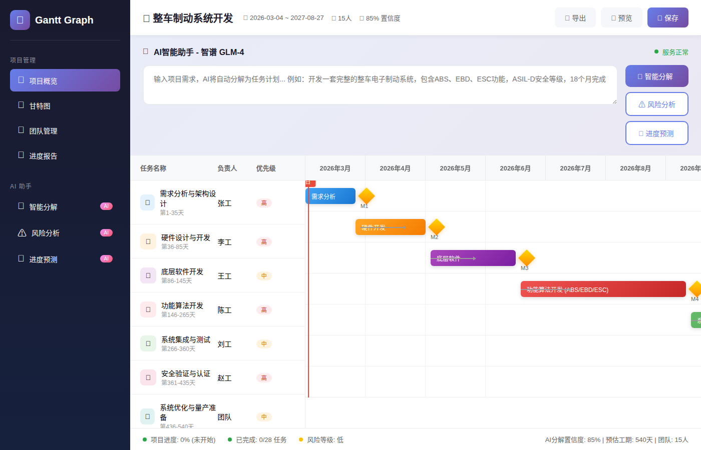
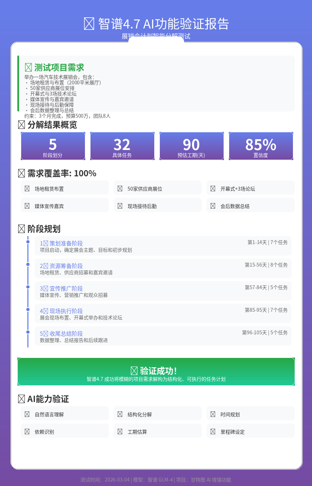

# Gantt Graph AI - AI增强版甘特图

<p align="center">
  
</p>

<p align="center">
  <a href="#功能特性">功能特性</a> •
  <a href="#快速开始">快速开始</a> •
  <a href="#AI功能">AI功能</a> •
  <a href="#项目结构">项目结构</a> •
  <a href="#技术栈">技术栈</a>
</p>

<p align="center">
  
  
  
  
  
</p>

## ✨ 功能特性

### 🤖 AI智能助手（核心亮点）
- **🧩 智能任务分解** - 输入自然语言需求，AI自动生成结构化项目计划
- **⚠️ 风险分析** - 自动识别项目风险，提供改进建议
- **🔮 进度预测** - 基于CPM算法预测项目完成时间，识别关键路径

### 📊 甘特图可视化
- 直观的任务时间线展示
- 里程碑管理
- 任务依赖关系可视化
- 进度跟踪

### 🎯 项目管理
- 多项目管理
- 团队任务分配
- 优先级设置
- 本地数据存储（IndexedDB）

## 🚀 快速开始

### 前端启动

```bash
# 安装依赖
npm install

# 启动开发服务器
npm run dev
```

### 后端AI服务启动

```bash
cd agent-service

# 安装Python依赖
pip install -r requirements.txt

# 配置环境变量
cp .env.example .env
# 编辑 .env 文件，填入你的智谱API Key

# 启动AI服务
python3 enhanced_ai_service.py
```

### 配置AI服务

编辑 `agent-service/.env`：

```env
LLM_PROVIDER=zhipu
LLM_API_KEY=your_zhipu_api_key_here
LLM_BASE_URL=https://open.bigmodel.cn/api/paas/v4
LLM_MODEL=glm-4
PORT=8000
```

获取智谱API Key：[https://platform.moonshot.cn/](https://platform.moonshot.cn/)

## 🧠 AI功能演示

### 1. 智能任务分解

输入项目需求：
```
开发一套完整的整车电子制动系统，包含：
- 主控制器：基于AUTOSAR架构的BCU
- 传感器系统：轮速、踏板位置、压力传感器  
- 执行机构：ESC模块、ABS阀体、EPB电机
- 核心功能：ABS、EBD、ESC、EPB、Autohold
- 技术要求：ASIL-D、ISO 26262、响应<200ms
- 开发周期：18个月，团队15人
```

AI输出：
- ✅ 7个开发阶段
- ✅ 28个具体任务
- ✅ 540天工期规划
- ✅ 任务依赖关系
- ✅ 关键里程碑

### 2. 技术要素覆盖分析

AI自动识别项目中的关键技术要素：
- ✅ 系统架构
- ✅ 传感器系统
- ✅ 执行机构
- ✅ 通信网络
- ✅ 功能开发
- ✅ 功能安全
- ✅ 测试验证

## 📁 项目结构

```
ganttGraph/
├── 📁 src/                      # 前端React源码
│   ├── components/              # 组件
│   ├── pages/                   # 页面
│   ├── stores/                  # 状态管理
│   └── utils/                   # 工具函数
├── 📁 agent-service/            # AI后端服务
│   ├── enhanced_ai_service.py   # FastAPI服务
│   ├── test_*.py                # 测试脚本
│   ├── requirements.txt         # Python依赖
│   └── .env.example             # 环境配置示例
├── 📁 web-demo/                 # Web演示
│   ├── gantt-preview.html       # 界面预览
│   └── gantt-screenshot.png     # 截图
├── 📄 package.json              # 前端依赖
├── 📄 vite.config.ts            # Vite配置
└── 📄 README.md                 # 项目说明
```

## 🛠️ 技术栈

### 前端
- **React 18** - UI框架
- **TypeScript** - 类型安全
- **Vite** - 构建工具
- **Zustand** - 状态管理
- **Dexie.js** - IndexedDB封装
- **@dnd-kit** - 拖拽交互

### 后端
- **FastAPI** - Python Web框架
- **OpenAI SDK** - LLM调用
- **智谱GLM-4** - AI模型
- **Pydantic** - 数据验证

## 🧪 测试验证

项目已验证的AI功能：

| 功能 | 状态 | 详情 |
|------|------|------|
| API连接 | ✅ | 智谱GLM-4响应正常 |
| 任务分解 | ✅ | 支持专业技术项目 |
| 风险分析 | ✅ | 识别延期、依赖风险 |
| 进度预测 | ✅ | CPM算法+关键路径 |

测试案例：
- [展销会计划](./agent-service/test_exhibition_glm4.py) - 活动策划类
- [制动系统开发](./agent-service/test_braking_system.py) - 汽车电子专业类

## 📸 界面展示

### 主界面


### AI功能展示


## 🤝 贡献

欢迎提交Issue和Pull Request！

## 📄 许可证

[MIT License](./LICENSE)

## 🙏 致谢

- [智谱AI](https://platform.moonshot.cn/) - 提供GLM-4模型支持
- [React](https://react.dev/) - 前端框架
- [FastAPI](https://fastapi.tiangolo.com/) - 后端框架

---

<p align="center">
  Made with ❤️ by Gantt Graph AI Team
</p>
